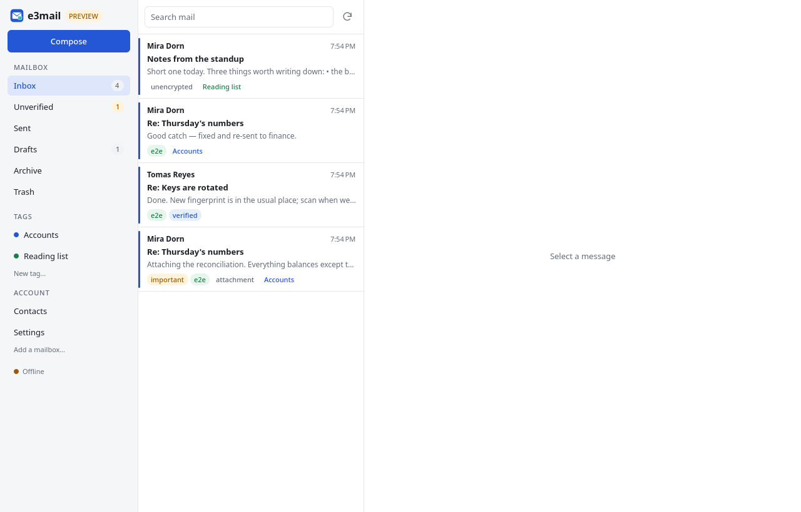
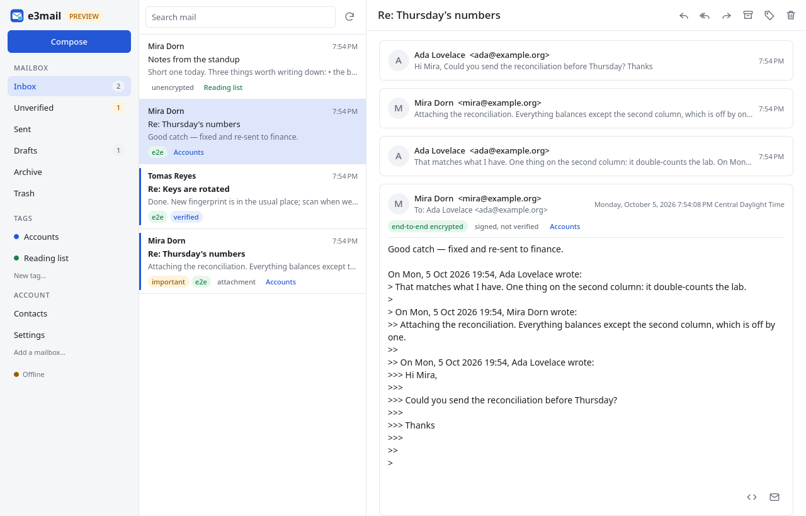
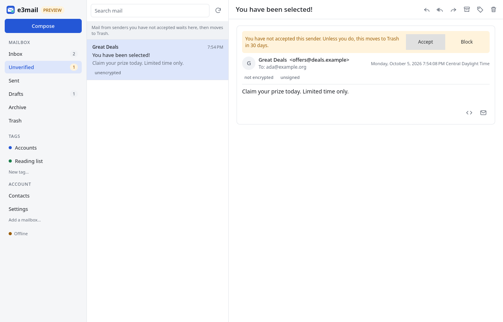
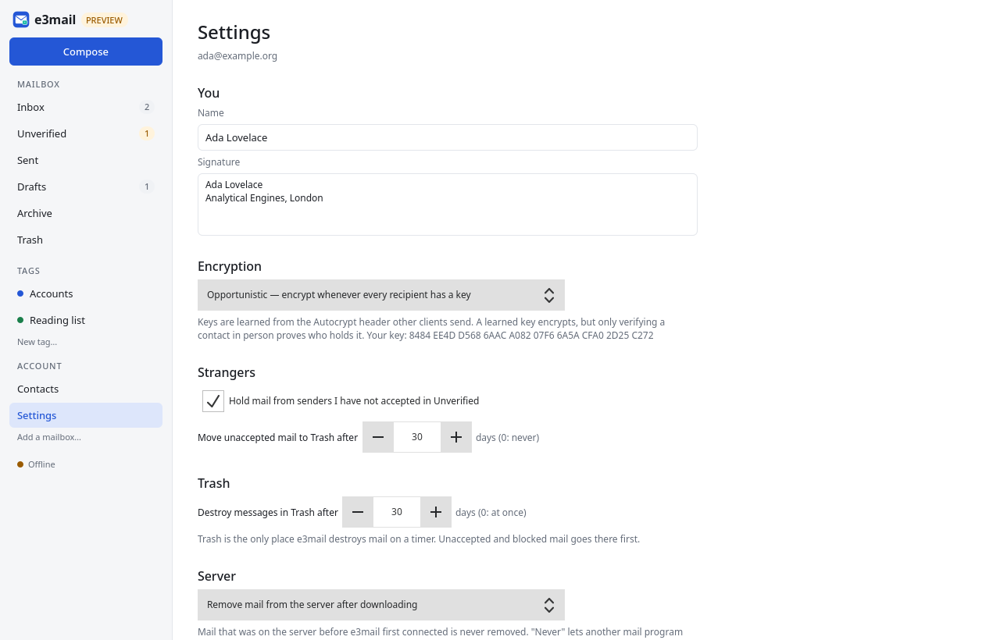

# e3mail

An end-to-end encrypted email client with classic email functionality, built
with Qt for Linux, Windows and macOS.

e3mail is a ground-up port of [eeemail](https://github.com/Yjlion/eeemail). It
keeps eeemail's ideas and drops its foundation: there is no Delta Chat engine
underneath. The engine is new C++ on Qt, with OpenPGP from
[RNP](https://www.rnpgp.org), and because it owns its own transport it receives
mail over **POP3 as well as IMAP**.

> **How this was built.** Most of the code and documentation here was written by
> a large language model working under human direction. It is reviewed and
> tested, and the tests pass. It has **not** been audited by a security
> professional, and an encrypted mail client is exactly the kind of software
> where that matters. Read it before you trust it, and do not rely on it for
> anything consequential yet.

## What it looks like

| | |
|---|---|
|  |  |
| **Inbox.** System tags and your tags on the left, encryption state on every row. | **Reading.** The thread, who it went to, and what the encryption actually was. |
|  |  |
| **Unverified.** Mail from senders you have not accepted, with a deadline you can see. | **Settings.** Every deadline is a setting, and each says what it destroys. |

These are rendered offscreen from a fixture mailbox by
[`scripts/screenshots.sh`](scripts/screenshots.sh), never from a real one. The
fixture is built by real accounts exchanging real, encrypted mail through an
in-process mail server.

## How it works

**IMAP and POP3 are transport only.** Mail is downloaded, decrypted, stored
locally and, by default, removed from the server. The local database is the
mailbox. Mail that was already on the server when e3mail first connected is
never deleted, and "keep N days" and "never delete" are both settings.

**Encryption is opportunistic and honest about it.** e3mail sends an
[Autocrypt](https://autocrypt.org) header, learns keys from the ones it
receives, and encrypts when *every* recipient has a key. Otherwise the message
goes in cleartext to everyone, and the composer says so before you send. Strict
mode refuses instead, and lenient mode encrypts only when every recipient asks
for it. A key learned from a header proves continuity, not identity, so
"encrypted" and "verified" are separate badges.

**There are no folders.** Inbox, Sent and Drafts are derived from what a
message is. Archive, Trash and Unverified are tags with meaning, and your own
tags sit on top. A message can carry several.

**Mail from strangers does not reach the inbox.** It waits in Unverified until
you accept or block the sender, and moves to Trash after 30 days (a setting).

**Exactly one thing deletes mail on a timer, and it is Trash.** Unaccepted mail,
blocked senders' mail and anything you throw away all arrive in Trash first,
and leave on one deadline you can set.

**Message content never reaches the network.** HTML is re-emitted through a tag
whitelist that drops every remote reference and counts what it removed. The
QML engine that renders it also has a network manager that refuses every
request. There is no web engine, scripts cannot run, and a link opens only
after you have seen where it goes.

## Status

**v0.1.0 — the MVP.** The engine and the desktop app work end to end, against
an in-process mail server in the tests and against real Postfix and Dovecot
over TLS in [`scripts/e2e.py`](scripts/e2e.py).

| Area | State |
|---|---|
| IMAP (IDLE) and POP3 receive, SMTP send, TLS and STARTTLS | ✅ |
| Server retention: delete after download / keep N days / never, not retroactive | ✅ |
| Local store, raw-message retention, full-text search | ✅ |
| Autocrypt, PGP/MIME, RFC 9788 protected headers, gossip | ✅ |
| Strict / opportunistic / lenient, per-contact overrides, per-message padlock | ✅ |
| Threads, system tags, user tags, Unverified, Trash, blocklist, importance | ✅ |
| Desktop app: list, threaded reading, composer, setup, contacts, settings | ✅ |
| Several accounts in one window, all fetching | ✅ |
| CI builds and tests on Linux, Windows and macOS | ✅ |
| `.deb`, AppImage, Windows installer + portable zip, macOS `.dmg` | ⏳ release workflow not yet run; AppImage built locally |
| Interop with GnuPG (our PGP/MIME decrypts and verifies) | ✅ |
| Multi-device sync over Iroh | ⏳ designed, Phase 8 |
| SecureJoin QR verification (Delta Chat compatible) | ⏳ Phase 9 |
| At-rest encryption, encrypted backup, read receipts, structured email | ⏳ later phases |
| Interop with Thunderbird, Delta Chat or a mainstream provider | ❌ |
| Code signing | ❌ |

See [`docs/handoff.md`](docs/handoff.md) for what is true right now, including
what is not.

## Build

You need Qt 6.8 or newer, CMake 3.21+, a C++20 compiler, SQLite with FTS5, and
RNP with Botan. On Arch, `pacman -S qt6-base qt6-declarative qt6-svg botan
json-c sqlite`, then [`scripts/build-rnp.sh`](scripts/build-rnp.sh) for RNP.
On Debian or Ubuntu use `librnp-dev`; on macOS, `brew install rnp`.

```sh
cmake --preset dev
cmake --build --preset dev
ctest --preset dev
./build/dev/src/app/e3mail
```

`e3mail-cli` drives the same engine from a terminal (`e3mail-cli --help`).
`--data-dir` points either program at another data directory. A `portable.txt`
beside the executable keeps data in `data/` next to it.

## Documentation

- [`docs/DESIGN.md`](docs/DESIGN.md) — architecture, phases, the multi-client design
- [`docs/adr/`](docs/adr/) — decisions, one per file
- [`docs/handoff.md`](docs/handoff.md) — current state, gaps, traps, next steps
- [`server/compose/`](server/compose/) — the test mail server

## License

[MPL-2.0](LICENSE). See [`NOTICE`](NOTICE) for the components binaries include.
